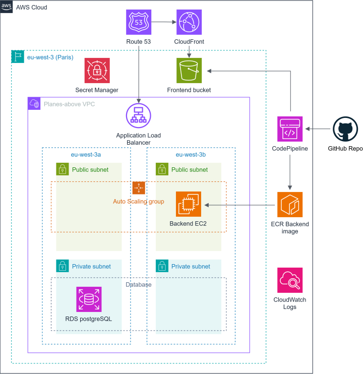

  <picture>
    <source media="(prefers-color-scheme: dark)" srcset=".github/assets/readme-logo-dark.svg">
    
  </picture>

# Planes above me

A cloud-hosted, open-source web app for identifying planes in your visual range in real time.

## Roadmap

- [x] Map view of planes updated every 10 seconds
- [x] Color coded plane icons based on altitude
- [x] Plane details panel with live metrics from ADS-B data
- [x] Dead reckoning using flat earth estimation for fast updates
- [x] Azimuth and elevation based on user's location using round earth calculations
- [x] Refactor for different view implementation
- [ ] Radar view
- [ ] Dome view (star-map style sky view)

## Cloud setup

The system is currently hosted on AWS, making use of what I learned in the AWS Cloud Practitioner certification.

  

The system follows best practices such as load balancing, multi-AZ deployment, IAM security, etc. Only the RDS database is deployed in a single AZ instead of the recommended multi-AZ because of the free plan limits.

